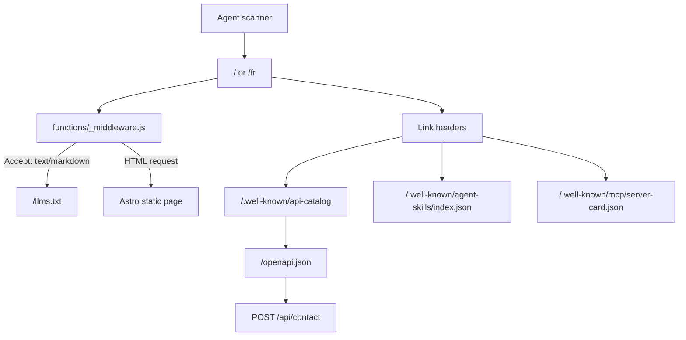

# Architecture

## Agent Discovery

- Cloudflare Pages Functions handle request-time negotiation and homepage discovery headers.
- Static public files provide agent-readable discovery artifacts.
- Browser WebMCP tools are registered only when `navigator.modelContext.provideContext` exists.
